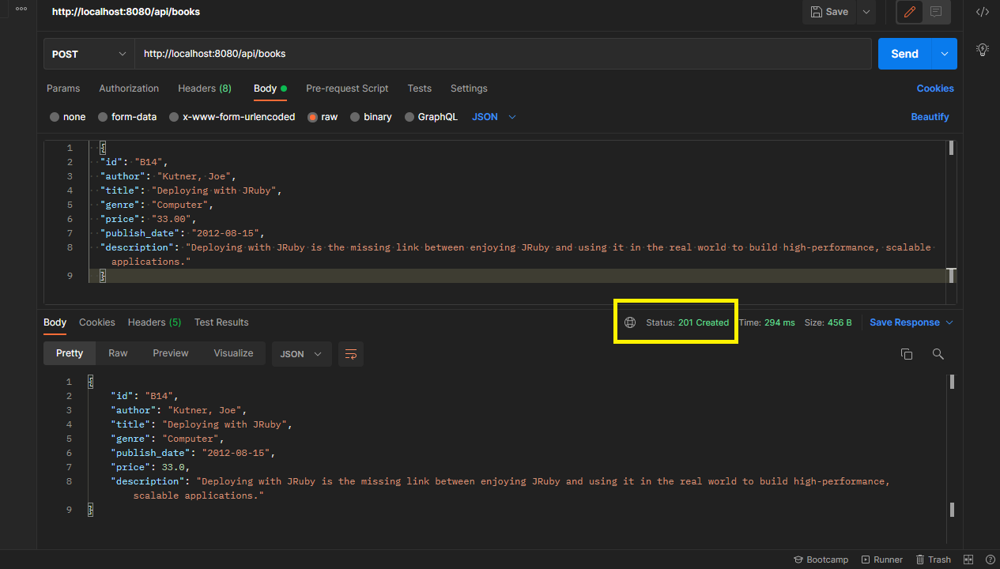
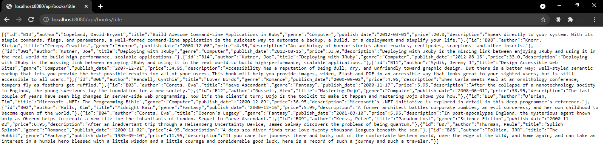

## Books API

### Written in JAVA 8

### Project Dependencies
- Spring Boot DevTools
- Lombok
- Spring Web
- Spring Data JPA
- MySQL Driver
- H2 Database
- Modelmapper

### How to Run
Clone or download the repository
Update pom.xml file and download dependencies
Run the application

Application will run by default on the:
http://localhost:8080

When application starts it will load the books 
from the JSON file and add them to the database.

### Use case examples:
http://localhost:8080/api/books returns all unsorted (B1-B13)

http://localhost:8080/api/books/id returns all sorted by id (B1-B13)

http://localhost:8080/api/books/id/b returns all with id containing 'b' sorted by id (B1-B13)

http://localhost:8080/api/books/id/1 returns all with id containing '1' sorted by id (B1, B10-13)

http://localhost:8080/api/books/author returns all sorted by author (B1-B13)

http://localhost:8080/api/books/author/joe returns all with author containing 'joe' sorted by author (B1)

http://localhost:8080/api/books/author/kut returns all with author containing 'kut' sorted by author (B1)

http://localhost:8080/api/books/title returns all sorted by title (B1-B13)

http://localhost:8080/api/books/title/deploy returns all with title containing 'deploy' sorted by title (B1)

http://localhost:8080/api/books/title/jruby returns all with title containing 'jruby' sorted by title (B1)

http://localhost:8080/api/books/genre returns all sorted by genre (B1-B13)

http://localhost:8080/api/books/genre/com returns all with genre containing 'com' sorted by genre (B1, B10-13)

http://localhost:8080/api/books/genre/ter returns all with genre containing 'ter' sorted by genre (B1, B10-13)

http://localhost:8080/api/books/price returns all sorted by price (B1-B13)

http://localhost:8080/api/books/price/33.0 returns all with price '30.0' (B1)

http://localhost:8080/api/books/price/30.0&35.0 returns all with price between '30.0' och '35.0' sorted by price (B1, B11)

http://localhost:8080/api/books/published returns all sorted by published_date (B1-B13)

http://localhost:8080/api/books/published/2012 returns all from '2012' sorted by published_date (B13, B1)

http://localhost:8080/api/books/published/2012/8 returns all from '2012-08' sorted by published_date (B1)

http://localhost:8080/api/books/published/2012/8/15 returns all from '2012-08-15' sorted by published_date (B1)

http://localhost:8080/api/books/description returns all sorted by description (B1-B13)

http://localhost:8080/api/books/description/deploy returns all with description containing 'deploy' sorted by description (B1, B13)

http://localhost:8080/api/books/description/applications returns all with description containing 'applications' sorted by description (B1)

### Unit test
- Create a new book 
  
- Delete book by Id 
  
- Search for an author

### Some Examples

Test API By using Postman:

- Add a new Book:
  By using Post method and JSON input
  http://localhost:8080/api/books

  {
  "id": "B14",
  "author": "Kutner, Joe",
  "title": "Deploying with JRuby",
  "genre": "Computer",
  "price": "33.00",
  "publish_date": "2012-08-15",
  "description": "Deploying with JRuby is the missing link between enjoying JRuby and using it in the real world to build high-performance, scalable applications."
  }
  
A new book will be created add added to the database. JSON response will show the created book.

  
Example, find all books sorted by title using web browser:

- Delete the book:
Delete method
http://localhost:8080/api/books/B01
  
- Update information about the book (Put Method):
  http://localhost:8080/api/books/

  {
  "id": "B01",
  "author": "Kutner, Joe",
  "title": "Deploying with Python",
  "genre": "Computer",
  "price": "56.00",
  "publish_date": "2012-08-15",
  "description": "Changed book description, title and price"
  }
  

